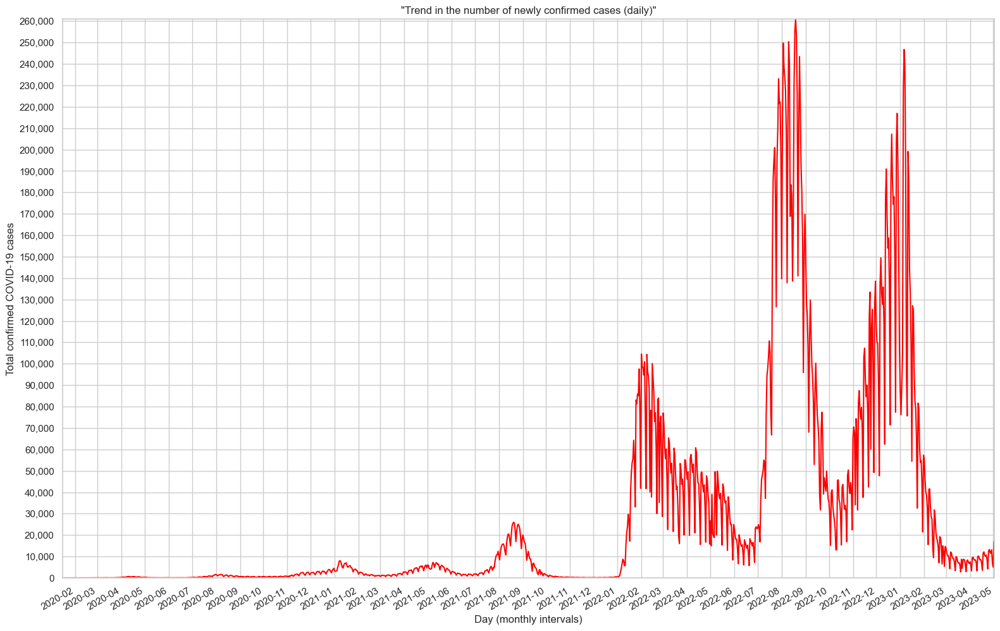
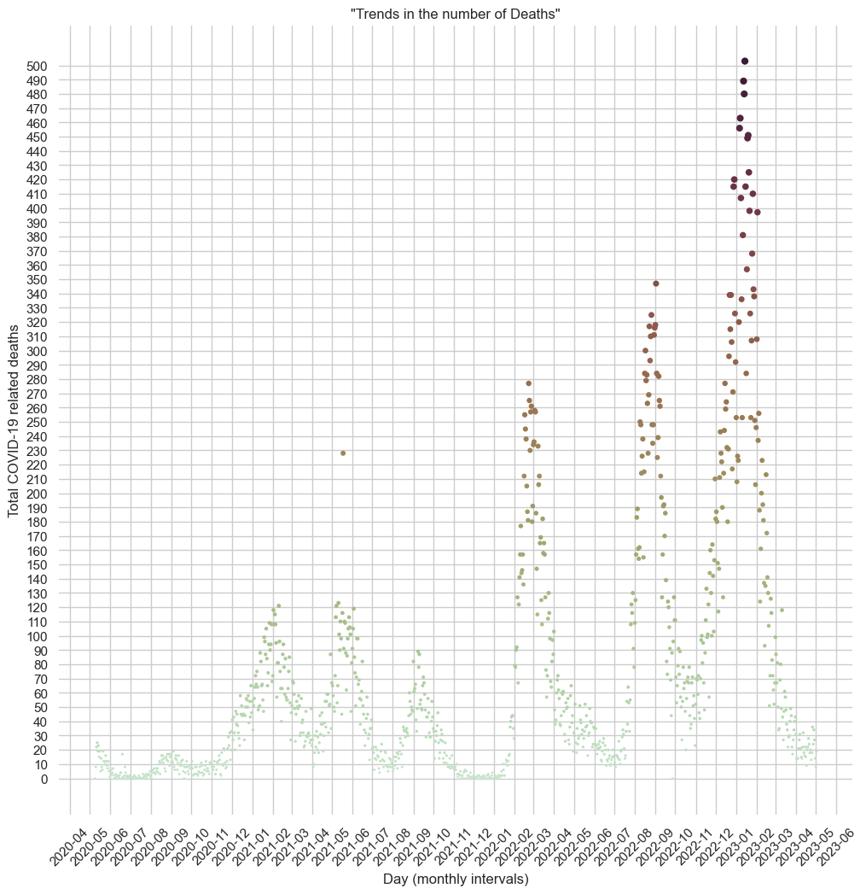

<h1 align="center"> Analyzing the COVID-19 situation in Japan </h1>

```python
import pandas as pd
import matplotlib as mpl
import numpy as np
import seaborn as sns
import matplotlib.pyplot as plt
from matplotlib.dates import MonthLocator, DateFormatter
import folium
import geopandas
```

```python
covid_data = pd.read_csv("coviddata.csv")
covid_data
```
| Date      | ALL   | Hokkaido | Aomori | Iwate | Miyagi | Akita | Yamagata | Fukushima | Ibaraki | Tochigi | Gunma | Saitama | Chiba | Tokyo | Kanagawa | Niigata | Toyama | Ishikawa | Fukui | Yamanashi | Nagano | Gifu | Shizuoka | Aichi | Mie | Shiga | Kyoto | Osaka | Hyogo | Nara | Wakayama | Tottori | Shimane | Okayama | Hiroshima | Yamaguchi | Tokushima | Kagawa | Ehime | Kochi | Fukuoka | Saga | Nagasaki | Kumamoto | Oita | Miyazaki | Kagoshima | Okinawa |
| --------- | ----- | -------- | ------ | ----- | ------ | ----- | -------- | --------- | ------- | ------- | ----- | ------- | ----- | ----- | -------- | ------- | ------ | -------- | ----- | --------- | ------ | ---- | -------- | ----- | --- | ----- | ----- | ----- | ----- | ---- | -------- | ------- | ------- | ------- | --------- | --------- | --------- | ------ | ----- | ----- | ------- | ---- | -------- | -------- | ---- | -------- | --------- | ------- |
| 1/16/2020 | 1     | 0        | 0      | 0     | 0      | 0     | 0        | 0         | 0       | 0       | 0     | 0       | 0     | 0     | 1        | 0       | 0      | 0        | 0     | 0         | 0      | 0    | 0        | 0     | 0   | 0     | 0     | 0     | 0     | 0    | 0        | 0       | 0       | 0       | 0         | 0         | 0         | 0      | 0     | 0     | 0       | 0    | 0        | 0        | 0    | 0        | 0         | 0       |
| 1/17/2020 | 0     | 0        | 0      | 0     | 0      | 0     | 0        | 0         | 0       | 0       | 0     | 0       | 0     | 0     | 0        | 0       | 0      | 0        | 0     | 0         | 0      | 0    | 0        | 0     | 0   | 0     | 0     | 0     | 0     | 0    | 0        | 0       | 0       | 0       | 0         | 0         | 0         | 0      | 0     | 0     | 0       | 0    | 0        | 0        | 0    | 0        | 0         | 0       |
| 1/18/2020 | 0     | 0        | 0      | 0     | 0      | 0     | 0        | 0         | 0       | 0       | 0     | 0       | 0     | 0     | 0        | 0       | 0      | 0        | 0     | 0         | 0      | 0    | 0        | 0     | 0   | 0     | 0     | 0     | 0     | 0    | 0        | 0       | 0       | 0       | 0         | 0         | 0         | 0      | 0     | 0     | 0       | 0    | 0        | 0        | 0    | 0        | 0         | 0       |
| 1/19/2020 | 0     | 0        | 0      | 0     | 0      | 0     | 0        | 0         | 0       | 0       | 0     | 0       | 0     | 0     | 0        | 0       | 0      | 0        | 0     | 0         | 0      | 0    | 0        | 0     | 0   | 0     | 0     | 0     | 0     | 0    | 0        | 0       | 0       | 0       | 0         | 0         | 0         | 0      | 0     | 0     | 0       | 0    | 0        | 0        | 0    | 0        | 0         | 0       |
| 1/20/2020 | 0     | 0        | 0      | 0     | 0      | 0     | 0        | 0         | 0       | 0       | 0     | 0       | 0     | 0     | 0        | 0       | 0      | 0        | 0     | 0         | 0      | 0    | 0        | 0     | 0   | 0     | 0     | 0     | 0     | 0    | 0        | 0       | 0       | 0       | 0         | 0         | 0         | 0      | 0     | 0     | 0       | 0    | 0        | 0        | 0    | 0        | 0         | 0       |
| …         | …     | …        | …      | …     | …      | …     | …        | …         | …       | …       | …     | …       | …     | …     | …        | …       | …      | …        | …     | …         | …      | …    | …        | …     | …   | …     | …     | …     | …     | …    | …        | …       | …       | …       | …         | …         | …         | …      | …     | …     | …       | …    | …        | …        | …    | …        | …         | …       |
| 4/28/2023 | 11452 | 886      | 155    | 99    | 229    | 141   | 117      | 173       | 173     | 150     | 165   | 567     | 530   | 1613  | 788      | 281     | 159    | 164      | 75    | 88        | 245    | 199  | 181      | 524   | 174 | 86    | 277   | 771   | 374   | 129  | 51       | 79      | 32      | 94      | 304       | 67        | 32        | 106    | 94    | 28    | 377     | 42   | 91       | 102      | 84   | 61       | 68        | 227     |
| 4/29/2023 | 13082 | 899      | 170    | 121   | 272    | 152   | 153      | 173       | 135     | 171     | 184   | 776     | 671   | 1923  | 984      | 347     | 199    | 140      | 70    | 106       | 253    | 255  | 205      | 568   | 137 | 135   | 268   | 981   | 435   | 113  | 70       | 69      | 32      | 108     | 269       | 120       | 33        | 89     | 115   | 27    | 446     | 45   | 86       | 91       | 96   | 67       | 68        | 255     |
| 4/30/2023 | 6754  | 435      | 64     | 47    | 131    | 44    | 89       | 97        | 225     | 78      | 63    | 261     | 285   | 976   | 567      | 123     | 53     | 78       | 30    | 76        | 218    | 120  | 184      | 206   | 142 | 33    | 116   | 460   | 326   | 85   | 69       | 29      | 14      | 62      | 368       | 31        | 5         | 62     | 27    | 8     | 187     | 12   | 23       | 29       | 73   | 22       | 36        | 85      |
| 5/1/2023  | 5033  | 339      | 69     | 53    | 97     | 32    | 69       | 71        | 47      | 97      | 53    | 279     | 233   | 837   | 462      | 59      | 74     | 76       | 25    | 57        | 119    | 132  | 71       | 176   | 36  | 20    | 160   | 346   | 104   | 51   | 41       | 55      | 11      | 28      | 116       | 36        | 32        | 36     | 45    | 9     | 108     | 9    | 30       | 38       | 46   | 24       | 26        | 99      |
| 5/2/2023  | 16972 | 1260     | 204    | 205   | 258    | 287   | 175      | 291       | 68      | 307     | 235   | 946     | 795   | 2604  | 1179     | 512     | 242    | 225      | 99    | 157       | 279    | 386  | 196      | 846   | 75  | 157   | 379   | 1353  | 418   | 164  | 64       | 98      | 71      | 124     | 130       | 101       | 73        | 148    | 150   | 54    | 600     | 98   | 130      | 137      | 109  | 73       | 128       | 382     |


```python
covid_data['Date'] = pd.to_datetime(covid_data['Date'])

covid_data.plot(kind='line', 
                x='Date', 
                y='ALL',
                grid=True,
                colormap="autumn",
                figsize=(19,13))

plt.xticks(rotation=45)
plt.title('"Trend in the number of newly confirmed cases (daily)"')
plt.xlabel('Day (monthly intervals)')
plt.ylabel('Total confirmed COVID-19 cases')
plt.gca().xaxis.set_major_locator(mpl.dates.MonthLocator()) 
plt.gca().xaxis.set_major_formatter(mpl.dates.DateFormatter("%Y-%m"))
plt.gcf().autofmt_xdate() # In order for the ticklabels not to overlap. HOWEVER, if there IS an overlap, remove this code
major_ticks=np.arange(0, 280000, 10000) # Values selected for Y axis
plt.yticks(major_ticks, major_ticks/10000) # If this outputs a decimal i.e. 500.0 etc., then remove "major_ticks, " 
    # For plt.yticks(actual, replacement), we provide the actual tick (data) values
    # And then the "replacement" values
plt.gca().yaxis.set_major_formatter(plt.matplotlib.ticker.StrMethodFormatter('{x:,.0f}')) # Add commas to Y axis
plt.margins(x=0,y=0)
plt.gca().get_legend().remove()
plt.show()
```


```python
death_data = pd.read_csv("deathdata.csv")
death_data['Date'] = pd.to_datetime(death_data['Date'])
death_data = death_data[['Date', 'ALL']]
death_data
```
| Date      | ALL |
| --------- | --- |
| 5/9/2020  | 0   |
| 5/10/2020 | 8   |
| 5/11/2020 | 22  |
| 5/12/2020 | 25  |
| 5/13/2020 | 19  |
| …         | …   |
| 4/28/2023 | 34  |
| 4/29/2023 | 27  |
| 4/30/2023 | 14  |
| 5/1/2023  | 8   |
| 5/2/2023  | 19  |

```python
sns.set_theme(style="whitegrid")
f, ax = plt.subplots(figsize=(12, 12))
plt.xticks(rotation=45)
plt.title('"Trends in the number of Deaths"')
plt.xlabel('Day (monthly intervals)')
plt.ylabel('Total COVID-19 related deaths')
sns.despine(f, left=True, bottom=True)
sns.scatterplot(x="Date", y="ALL",
                hue="ALL", size="ALL",
                palette="ch:s=.2,r=.7",
                sizes=(4, 36), linewidth=0,
                data=death_data,
                legend=False,
                ax=ax)
major_ticks=np.arange(0, 510, 10)
plt.yticks(major_ticks/1)
plt.gca().xaxis.set_major_locator(mpl.dates.MonthLocator()) 
plt.gca().xaxis.set_major_formatter(mpl.dates.DateFormatter("%Y-%m"))
plt.show()
```


```python
import leafmap.foliumap as leafmap

j = leafmap.Map(center=[35.6895, 139.6917], zoom=5)
cumulative_data = pd.read_csv("confirmed_cases_cumulative.csv")
cumulative_data = cumulative_data[['Prefecture', 'Total Number', 'Incidence Rate', 'X', 'Y']]
cumulative_data

j.add_title("Cumulative number of COVID-19 cases per prefecture",
            font_size="20px", 
            align="center") 

j.add_geojson('dataoki.geojson')
j.add_points_from_xy(cumulative_data, x="Y", y="X",
                    color_column='Incidence Rate',
                     icon_names=['ambulance'],
                    marker_colors = ['blue', 'red'])
                    
```
<div align="center">
<table>
<tbody>
<td align="center">
<br>
<sub>
<a href="https://garygarygg.glitch.me/jmap.html"><b>Map of cumulative number of Japan COVID-19 cases per prefecture</b></a></sub><br>

</td>
</tbody>
</table>
</div>

## Project Goal:
To analyze the COVID-19 situation in Japan and identify key trends and insights using publicly available data, focusing on nonlinear regression and geographical analysis.
Data Sources:
1.	COVID-19 data: confirmed cases (infection rate), deaths (death rate), cumulative data; was collected from the official Japanese government COVID-19 website: https://covid19.mhlw.go.jp/en/ [^1]
2.	Geographical Data was collected from OpenStreetMap: https://www.openstreetmap.org/

## Language, Modules and Libraries:
Python, Pandas, Numpy, Matplotlib, Seaborn, Folium, ipyleaflet, GeoJSON, Geopandas, Leafmap

## Methodology:
Until May 2023 and at the time of conducting this project, data for COVID-19 was collected and shared daily by the Japan Ministry of Health, Labour and Welfare. This data was downloaded and wrangled before being loaded into separate pandas data frames for analysis and plotting. 
Nonlinear regression models were plotted into line and scatter plot charts to visualize the daily infection rate and daily death rate respectively, with the timeline for these data sets covering three years.
In terms of visual geographical analysis, cumulative numbers for confirmed COVID-19 cases over the aforementioned time period for each prefecture were plotted onto the map of Japan. These were plotted as marker clusters which included the latitude and longitude values for each prefecture. Vector data of Japan was also created as a GeoJSON.

## Analysis and conclusion:
What we can see from the chart for the infection rate is that, between 2021 and 2023 - during the colder months, mostly January and February - it had spiked, before slowly tapering off into March and April. Another spike can be seen in August and September, consistently from 2020 to 2022.

We can also see that the infection rate from 2022 onwards was mostly always above 20,000 cases; whereas in 2021, outside of the abovementioned spike period, it never rose above 10,000 cases.

With regards to the death rate, as per the chart, a daily count exceeding 500 was only observed once. In addition, we can see similar patterns when compared to the daily infection rate i.e., spikes in January and February as well as August and September. 

Another aspect to note is that we can see a spike in the death - and to a lesser extent, the infection rate - for May and June 2021, but this pattern is not necessarily observed again for May and June 2022 relative to other periods during the year.

When reflecting on the above data, we can see similarities in the timings of the spikes for both the infection and death rates, signifying a strong correlation. Because the spikes for both had been happening congruently during the same periods over the years, the data suggests that ultimately, the higher number of infected individuals, the higher the death count. This can be significant to note because what the data does not suggest, are scenarios whereby people are infected and then die after significant time had elapsed, meaning COVID-19 related deaths had mostly occurred within one month of confirmation of COVID-19. Indeed, when exploring further, data from other findings indicated that the median time it takes from the first symptoms of COVID-19 to death was roughly 18 days. [^2] [^3] 

As per the Japan map data, prefectures with the highest cumulative numbers were those with higher urban density e.g., Tokyo and prefectures surrounding Tokyo; as well the prefecture in the colder region of the country i.e., Hokkaido prefecture. We can see that the map data supports this, with such prefectures categorized as high-prevalence areas (the condition for a high-prevalence area is 1,000,000 or more cumulative numbers).

It would have been interesting to see whether or not the numbers would repeat itself for August and September 2023, however because the Japan Ministry of Health, Labour and Welfare ceased recording its data as of May 2023, the possibility of verifying this is unlikely. Nonetheless, the historical data is there, to help preempt and/or mitigate any risk concerning COVID-19 for 2023 and beyond.

[^1]: Note that the Japan Ministry of Health, Labour and Welfare had stopped compiling and updating its COVID-19 data as of May 2023
[^2]: https://www.drugs.com/medical-answers/covid-19-symptoms-progress-death-3536264/
[^3]: https://bmcmedresmethodol.biomedcentral.com/articles/10.1186/s12874-021-01314-w
